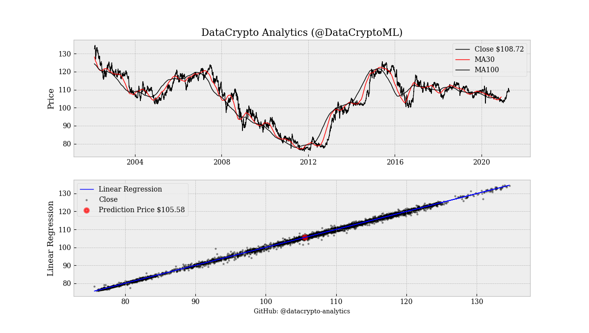
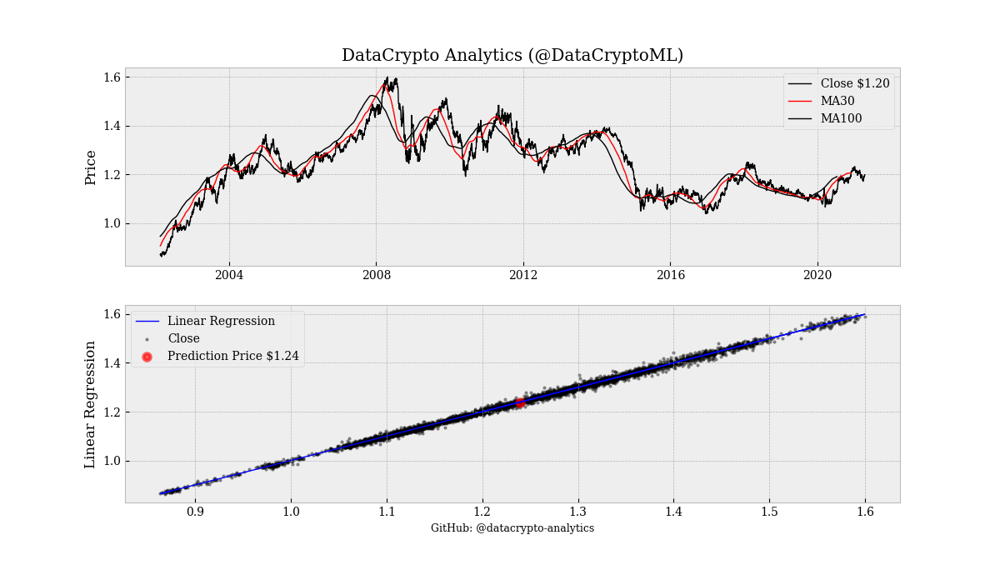

# Quant Analysis CLI

Quantitative analysis CLI for Forex and Cryptocurrencies.

------ 
 <h3> <a rel="datacryptoanalytics" href="https://datacryptoanalytics.com/">Descrição/Description </a></h3>

Algoritmos com aprendizado de máquina para o mercado <b>Forex</b> e de <b>Criptomoedas</b>. Desenvolvido com rede neural e árvore de decisões que analisa as possiveís movimentações do mercado.

- Observe que no site temos a página <b> <a href = "https://datacryptoanalytics.com/analytics/predictive"> Análise Preditiva</a></b>, está hospedado o <i>Backtesting</i> da nossa última versão, e em nosso canal no  <a rel="Youtube" href="https://www.youtube.com/channel/UCxfGBCV9E04Uw4flJLjBCqg?view_as=subscriberl">Youtube</a> vídeos de instalação e configuração.

------
Quantitative Machine Learning Algorithms for the <b> Cryptocurrencies </b> and <b>Forex</b> market. Developed with neural network and decision tree that analyzes the possible movements of the market.

- Note that on the website we have the <b> <a href = "https://datacryptoanalytics.com/analytics/predictive"> Predictive Analytics</a> </b> page, the <i> Backtesting </i> of our latest version is hosted, and on our channel at <a rel = "Youtube" href = "https: //www.youtube.com/channel/UCxfGBCV9E04Uw4flJLjBCqg?view_as=subscriberl">Youtube </a> installation and configuration videos.

-----
## Download Linux

`~$ git clone https://github.com/datacrypto-analytics/quant-analysis-cli.git`

`~$ cd quant-analysis-cli`

 <h3> <a href="https://www.anaconda.com/products/individual#Downloads">Download Anaconda</a></h3>
 
-----

## Instalar dependências necessárias/Install required dependencies 

- Instalar Requeriments.txt

`~$ pip install -r requirements.txt`

-----

## API KEY

Criar API KEY <b> <a href = "https://www.alphavantage.co/support/#api-key"> alphavantage.co/api-key </a> </b>

-----

## Iniciar algoritmo/Run algorithms

`~$ python forex-rl-v0.1-PT.py`

`~$ python regressao-linear-v0.3-2-PT.py`

`~$ python forex-rl-intraday-v0.1-beta-PT.py`

-----

<pre>(base) <b>[felipe@datacrypto-analytics</b><b> quant-analysis-cli</b><b>]$</b> python forex-rl-v0.2-PT.py 
 ____        _         ____                  _        
|  _ \  __ _| |_ __ _ / ___|_ __ _   _ _ __ | |_ ___  
| | | |/ _` | __/ _` | |   | &apos;__| | | | &apos;_ \| __/ _ \ 
| |_| | (_| | || (_| | |___| |  | |_| | |_) | || (_) |
|____/ \__,_|\__\__,_|\____|_|   \__, | .__/ \__\___/ 
                                 |___/|_|             
    _                _       _   _          
   / \   _ __   __ _| |_   _| |_(_) ___ ___ 
  / _ \ | &apos;_ \ / _` | | | | | __| |/ __/ __|
 / ___ \| | | | (_| | | |_| | |_| | (__\__ \
/_/   \_\_| |_|\__,_|_|\__, |\__|_|\___|___/
                       |___/                

 | Algoritmo: forex-rl 
 | Versão: v0.2-PT 

 | Twitter @DataCryptoML 
 | Github @datacrypto-analytics 
 | https://datacryptoanalytics.com/ 
 
Digite o par Forex listada na ALPHA VANTAGE: USDJPY
O par Forex informada foi: USDJPY
DataCrypto Analytics recuperando dados: 291kB [00:05, 50.3kB/s] 
DataCrypto Analytics preparando dados: 2326it [00:23, 98.37it/s]
DataCrypto Analytics preparando dados: 100%|████████████████████████████████████████████████████████| 8/8 [00:00&lt;00:00, 57.84it/s]
________________________________________________________________________________

 Preço de fechamento:  108.725
________________________________________________________________________________
________________________________Resultados______________________________________

 Coefficients:  [[0.99857121]]
________________________________________________________________________________

 Mean squared error (MSE): 0.40
________________________________________________________________________________

 Score de variância (próximo de 1.0 bom &gt; ruim): 1.00
________________________________________________________________________________

 Média previsões: 105.5798954
________________________________________________________________________________
</pre>

-----

## Donate

-----

## Aviso Legal: 

*As informações nestas páginas contêm declarações prospectivas que envolvem riscos e incertezas. Os mercados e instrumentos perfilados nesta página são apenas para fins informativos e não devem, de forma alguma, ser visto como uma recomendação de compra ou venda desses ativos. Você deve fazer sua própria pesquisa completa antes de tomar qualquer decisão de investimento. DataCrypto Analytics não garante de forma alguma que esta informação esteja livre de erros ou distorções materiais. Também não garante que essas informações sejam oportunas. Investir em mercados abertos envolve muitos riscos, incluindo a perda total ou parcial de seu investimento, bem como estresse emocional. Todos os riscos, perdas e custos associados ao investimento, incluindo a perda total do principal, são de sua responsabilidade.*
